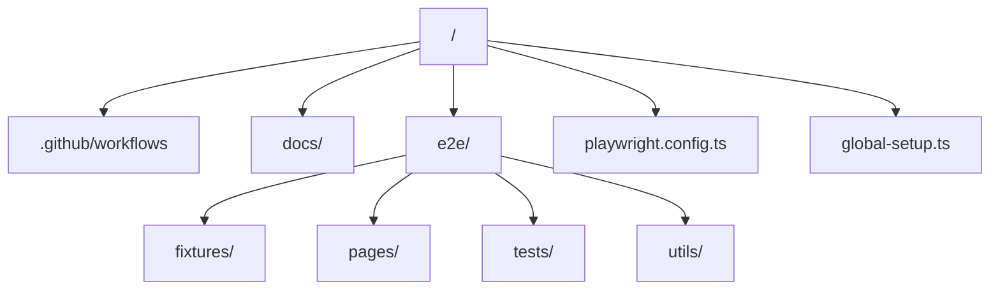

# 🌐 Conduit QA Framework

[](https://playwright.dev/)
[](https://www.typescriptlang.org/)
[](https://opensource.org/licenses/MIT)

A production-grade, end-to-end automation framework built for the [Conduit (RealWorld)](https://demo.realworld.show/) application. This repository leverages modern QA engineering best practices to deliver a stable, fast, and scalable testing solution.

---

## ✨ Key Features

- **🎯 Strategic Architecture**: Page Object Model (POM) design pattern for high maintainability and code reuse.
- **⚡ Lightning-Fast Auth**: storageState caching directly in `localStorage` — bypassing UI login for authenticated tests to reach stable states 3-4x faster.
- **🛡️ Flaky-Resistant**: Uses `waitForResponse` intercepts to validate backend state instead of relying on unpredictable DOM racing.
- **📦 Clean Test Data**: Zero-dependency uniqueness strategy using dynamic `Date.now()` suffixes to guarantee data isolation in parallel runs.
- **📊 Traceability & Debugging**: Automatic artifacts on failure — HTML reports, screenshots, and execution traces for rapid root-cause analysis.
- **🚀 CI/CD Ready**: Fully configured for headless parallel execution via GitHub Actions.

---

## 📂 Project Navigation



---

## 🏁 Quick Start

### 1. Prerequisites
Ensure you have [Node.js](https://nodejs.org/) (v20.x+) installed.

### 2. Installation
```bash
# Install dependencies
npm install

# Install Playwright browser engines
npx playwright install --with-deps
```

### 3. Execution
| Goal | Command |
|---|---|
| Run all tests | `npm run test:e2e` |
| Smoke suite only | `npm run test:e2e:smoke` |
| Regression suite only | `npm run test:e2e:regression` |
| Interactive UI Mode | `npm run test:e2e:ui` |
| Debugging Inspector | `npm run test:e2e:debug` |
| Last HTML Report | `npm run report` |

---

## ⚙️ Environment Configuration

Playwright handles environment variables natively. Key variables include:

- **`BASE_URL`**: `https://demo.realworld.show` (The UI entry point)
- **`API_BASE_URL`**: `https://api.realworld.show` (Used for background user provisioning)

*Note: Auth tokens and dynamic test users are provisioned automatically via `global-setup.ts` into `.auth/session.json`.*

---

## 🤖 AI-Native Development & Memory

This framework lives an "AI-First" lifecycle. Its development history, architectural decisions, and technical lessons (like the refactoring for hash-routing compatibility) are tracked in the **Project Memory** system:

- 📑 **Architecture Log:** [project_conduit_framework.md](docs/project_conduit_framework.md)
- 📝 **Scenario Inventory:** We co-created a list of Happy Paths, Edge Cases, and Failure Paths (Scenarios documented in memory for future scale).

The use of AI here acted as a **productivity catalyst**, enabling a senior-level architecture with complete documentation while maintaining strict human oversight and manual code validation.

---

<p align="center">
  Generated with ❤️ for the QA Engineering community.
</p>